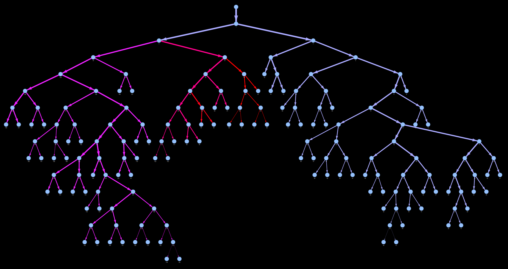

<div align="center">

# GraphScore

Compute Scores for Pulmonary Embolism Risk from Arterial Tree Graphs

</div>

&#160;

## Installation

Install [uv](https://docs.astral.sh/uv/) if you don't have it already.

```bash
pip install uv
```

Create a virtual environment using uv and sync the dependencies.

```bash
uv venv
source .venv/bin/activate
uv sync
```

&#160;

## Project Structure

- `graphscore/`: Core CLI implementation
- `tree/`: Graph modeling, processing, and I/O utilities
- `commands/`: Implementation of scoring algorithms (Mastora, Qanadli), visualization and correlation
- `data/graphs/`: Storage for patient graph data files
- `data/attribute_graphs/`: Default storage for attribute-enhanced generated graphs
- `data/clinical_data.csv`: CSV file containing patient IDs and clinical data for `correlate` command

&#160;

## CLI Commands

**Input Format**: Patient IDs are auto-padded to 4 digits and resolved to `data/graphs/{id}_graph_ep_transversal_obstruction.json`.

### ▶️ `mastora`

Score details are available in [`formulas.md`](assets/formulas.md#mastora-score).

| **Description** | Compute Mastora score for pulmonary embolism risk                                                                                                                                                                                                                                                                                                                                        |
| --------------- | ---------------------------------------------------------------------------------------------------------------------------------------------------------------------------------------------------------------------------------------------------------------------------------------------------------------------------------------------------------------------------------------- |
| **Usage**       | `mastora INPUT_FILE [OPTIONS]`                                                                                                                                                                                                                                                                                                                                                           |
| **Input**       | JSON graph file or patient ID (e.g., `0055`)                                                                                                                                                                                                                                                                                                                                             |
| **Options**     | `--use-percentage, -p`: Treat degrees as obstruction percentages (0 to 1)<br>`--mode, -m TEXT`: Artery levels to include: 'm' (mediastinal), 'l' (lobar), 's' (segmental). Default: 'mls'<br>`--obstruction-attr, -o TEXT`: Edge attribute to use for obstruction values. Default: 'max_transversal_obstruction'<br>`--debug, -d`: Show a debug visualization of the Mastora calculation |
| **Examples**    | `mastora 55`<br>`mastora 0055 -p -m mls`<br>`mastora 0055 -d`                                                                                                                                                                                                                                                                                                                            |

### ▶️ `qanadli`

Score details are available in [`formulas.md`](assets/formulas.md#mastora-score).

| **Description** | Compute Qanadli score for pulmonary embolism risk                                                                                                                                                                                                                                                                                                                                                                           |
| --------------- | --------------------------------------------------------------------------------------------------------------------------------------------------------------------------------------------------------------------------------------------------------------------------------------------------------------------------------------------------------------------------------------------------------------------------- |
| **Usage**       | `qanadli INPUT_FILE [OPTIONS]`                                                                                                                                                                                                                                                                                                                                                                                              |
| **Input**       | JSON graph file or patient ID (e.g., `0055`)                                                                                                                                                                                                                                                                                                                                                                                |
| **Options**     | `--min-obstruction-thresh, -n FLOAT`: Minimum obstruction threshold for considering a segment. Default: 0.25<br>`--max-obstruction-thresh, -x FLOAT`: Maximum obstruction threshold for considering a segment. Default: 0.75<br>`--obstruction-attr, -o TEXT`: Edge attribute to use for obstruction values. Default: 'max_transversal_obstruction'<br>`--debug, -d`: Show a debug visualization of the Qanadli calculation |
| **Examples**    | `qanadli 55`<br>`qanadli 0055 -n 0.3 -x 0.8`<br>`qanadli 0055 -d`                                                                                                                                                                                                                                                                                                                                                           |

### ▶️ `generate-attribute`

| **Description** | Generate attribute-enhanced graph and save it to NetworkX JSON file                                           |
| --------------- | ------------------------------------------------------------------------------------------------------------- |
| **Usage**       | `generate-attribute [INPUT_FILE] [OPTIONS]`                                                                   |
| **Input**       | JSON graph file or patient ID (e.g., `0055`). If omitted, processes all graphs in the data/graphs directory   |
| **Options**     | `--output-dir, -d TEXT`: Directory where to save the attribute graph files. Default: 'data/attribute_graphs/' |
| **Examples**    | `generate-attribute 0055`<br>`generate-attribute 55 -d custom/output/dir/`<br>`generate-attribute`            |

### ▶️ `visualize`

| **Description** | Visualize attribute values using PyVis interactive network                                                          |
| --------------- | ------------------------------------------------------------------------------------------------------------------- |
| **Usage**       | `visualize INPUT_FILE [OPTIONS]`                                                                                    |
| **Input**       | JSON graph file or patient ID (e.g., `0055`)                                                                        |
| **Options**     | `--obstruction-attr, -o TEXT`: Edge attribute to use for obstruction values. Default: 'max_transversal_obstruction' |
| **Examples**    | `visualize 0055`<br>`visualize 55 -o max_transversal_obstruction`                                                   |

### ▶️ `correlate`

| **Description** | Correlate graph scores with clinical attributes and visualize the results                                                                                                                                                                                                                                                                                                                                                                                                                   |
| --------------- | ------------------------------------------------------------------------------------------------------------------------------------------------------------------------------------------------------------------------------------------------------------------------------------------------------------------------------------------------------------------------------------------------------------------------------------------------------------------------------------------- |
| **Usage**       | `correlate SCORE_NAME ATTRIBUTE_NAME [OPTIONS]`                                                                                                                                                                                                                                                                                                                                                                                                                                             |
| **Arguments**   | `SCORE_NAME`: Score type to compute (mastora, qanadli)<br>`ATTRIBUTE_NAME`: Clinical attribute to correlate with (bnp, troponin, risk, spesi)                                                                                                                                                                                                                                                                                                                                               |
| **Options**     | `--clinical-data, -c TEXT`: Path to the clinical data CSV file. Default: 'data/clinical_data.csv'<br>`--graphs-dir, -g TEXT`: Path to the directory containing graph JSON files. Default: 'data/graphs/'<br>`--obstruction-attr, -o TEXT`: Edge attribute to use for obstruction values. Default: 'max_transversal_obstruction'<br>`--all-attributes, -a`: Compare all obstruction attributes in subplots<br>`--show-visualization, -v`: Show the correlation plot visualization in browser |
| **Examples**    | `correlate mastora bnp -v`<br>`correlate qanadli troponin -c custom/clinical_data.csv`<br>`correlate mastora risk -g custom/graphs/ -o max_transversal_obstruction_propagated`                                                                                                                                                                                                                                                                                                              |

&#160;

### List of `--obstruction-attr`

| **Attribute**                            | **Description**                                                    |
| ---------------------------------------- | ------------------------------------------------------------------ |
| `max_transversal_obstruction`            | Maximum transversal obstruction value across one edge of the graph |
| `max_transversal_obstruction_propagated` | `own_mtop = max(parent_mto, own_mto)`                              |
| `max_transversal_obstruction_cumulated`  | `own_mtoc = 1 - (1 - parent_mto) * (1 - own_mto)`                  |

### Visualization Examples

<div align="center">
  <table width="100%">
    <tr>
      <td width="50%" align="center"><b><code>visualize 55 -o max_transversal_obstruction</code></b></td>
      <td width="50%" align="center"><b><code>visualize 55 -o max_transversal_obstruction_propagated</code></b></td>
    </tr>
    <tr>
      <td width="50%" align="center"></td>
      <td width="50%" align="center"></td>
    </tr>
  </table>
</div>

&#160;

## NetworkX Graph Compatibility

| Function             | Underlying acyclicity | Underlying connectivity | In-degree ≤ 1 | Type       | Morgane's graphs compatibility |
| -------------------- | --------------------- | ----------------------- | ------------- | ---------- | ------------------------------ |
| `is_forest(G)`       | Yes                   | Not required            | No            | Undirected | Yes                            |
| `is_tree(G)`         | Yes                   | Yes                     | No            | Undirected | Yes                            |
| `is_branching(G)`    | Yes                   | Not required            | Yes           | Directed   | Yes                            |
| `is_arborescence(G)` | Yes                   | Yes                     | Yes           | Directed   | Yes                            |

&#160;

## Scores Comparison

```bash
correlate mastora risk -a
correlate qanadli risk -a
correlate mastora bnp -a
correlate qanadli bnp -a
correlate mastora troponin -a
correlate qanadli troponin -a
```
